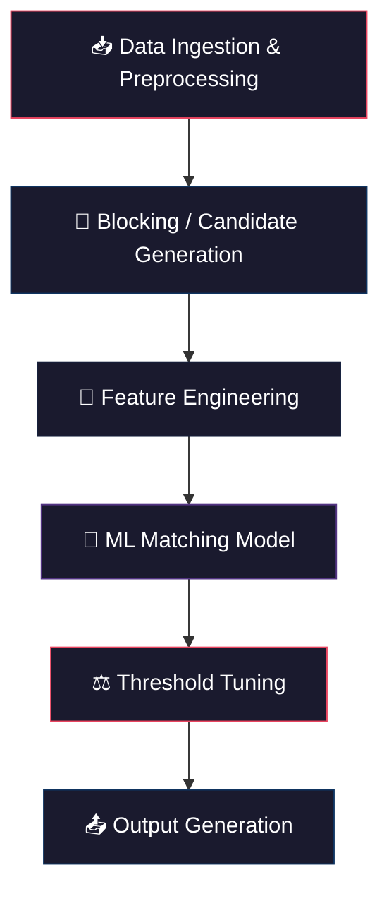

# 🏆 Amazon ML Challenge 2026 — Business Entity Resolution
## Comprehensive Solution Plan

---

## 1. Problem Summary

| Aspect | Detail |
|---|---|
| **Task** | Given business records from 3 independent sources (noisy, no shared IDs), determine which records across sources refer to the **same real-world business** |
| **Reference Source** | Source 1 (deduplicated) — find matches from Source 2 & Source 3 for each S1 entity |
| **Fields** | `entity_id`, `business_name`, `business_address`, `country` |
| **Metric** | **F₀.₅ (macro-averaged)** — precision-heavy (precision weighted 2× over recall) |
| **Train Countries** | US, India |
| **Test Countries** | US, India, **+ France** (unseen!) |
| **Output** | `matching_results.tsv` + `candidate_pairs.tsv` |
| **Constraints** | Models ≤ 8B params, MIT/Apache 2.0 license, **NO external APIs/data** |
| **Submissions** | 5/day × 3 days = 15 total |

> [!IMPORTANT]
> **F₀.₅ is precision-heavy** → A false merge (matching two different businesses) is MORE costly than missing a match. We must be conservative in matching.

> [!WARNING]
> **France is unseen in training** → The pipeline must NOT hard-code country-specific logic. Must generalize across address formats.

---

## 2. High-Level Architecture



---

## 3. Detailed Pipeline Plan

### Phase 1: Data Ingestion & Preprocessing

**Goal**: Clean and normalize text fields to reduce superficial noise before blocking.

| Step | Action | Why |
|---|---|---|
| 1.1 | Load all TSVs with `sep="\t"` | Avoid silent single-column parse |
| 1.2 | Lowercase all text fields | Case-insensitive matching |
| 1.3 | Normalize Unicode (NFKD) | Handle transliterations (French accents, Hindi) |
| 1.4 | Standardize legal suffixes | `pvt` → `private`, `ltd` → `limited`, `corp` → `corporation`, `inc` → `incorporated`, `llc`, `sarl` (France), `sas`, `gmbh`, etc. |
| 1.5 | Normalize punctuation | `&` → `and`, remove extra whitespace, strip leading/trailing junk |
| 1.6 | Address component extraction | Extract tokens: street number, street name, city, state, zip/PIN, country |
| 1.7 | Abbreviation expansion | `rd` → `road`, `st` → `street`, `ave` → `avenue`, `blvd` → `boulevard`, `dr` → `drive` |
| 1.8 | Remove stopwords from business names | Drop `the`, `of`, `and` etc. for cleaner matching |
| 1.9 | Create n-gram tokens | Character 3-grams and word tokens for fuzzy blocking |

### Phase 2: Blocking / Candidate Generation

**Goal**: Reduce the O(N²) comparison space while preserving maximum recall. This sets the **recall ceiling** for the entire pipeline.

> [!TIP]
> Blocking is the single most important stage. Poor blocking = impossible to recover recall downstream.

#### Strategy: same-country word and number indexes

On 4,000 true train pairs, every match was in the same country, and a shared name word or address number covered **90.5%**. Character n-grams were the only clue for **4.8%**, and they are the slow part, so `src/blocking.py` does not build them.

Block inside each country label (France is just another label). Keys, each dropped when too common:

| Key | What it catches | DF cap |
|---|---|---|
| Name word (length ≥ 3) | same business name, including reordered words | 250 |
| Address word (length ≥ 5) | street or landmark | 150 |
| Address number (3+ digits) | same premises | 200 |
| First 5 letters of the longest name word | cheap typo / truncation catch | 80 |
| Exact sorted name, group size ≤ 40 | same words, any order | — |

Score is the sum of IDF weights. Each Source-1 row keeps the **top 80** candidates with score ≥ 5. Run **once** on train (`--mode full`), read `BLOCKING RECALL`, then the same settings on test. No package install.

```bash
python src/blocking.py --mode full --preprocessed /kaggle/input/<dataset> --output /kaggle/working/output
python src/blocking.py --mode test --preprocessed /kaggle/input/<dataset> --output /kaggle/working/output
```

### Phase 3: Feature Engineering

**Goal**: For each (S1, candidate) pair, compute rich similarity features.

#### Name Features
| Feature | Method |
|---|---|
| `name_levenshtein` | Normalized Levenshtein distance |
| `name_jaro_winkler` | Jaro-Winkler similarity (good for short strings) |
| `name_jaccard_tokens` | Jaccard on word tokens |
| `name_jaccard_3grams` | Jaccard on character 3-grams |
| `name_tfidf_cosine` | Cosine similarity of TF-IDF vectors |
| `name_sorted_token_ratio` | `fuzzywuzzy.token_sort_ratio` |
| `name_partial_ratio` | `fuzzywuzzy.partial_ratio` |
| `name_contains` | One name is a substring of the other |
| `name_token_overlap_pct` | % of tokens shared |
| `name_length_ratio` | len(shorter) / len(longer) |

#### Address Features
| Feature | Method |
|---|---|
| `addr_levenshtein` | Normalized Levenshtein |
| `addr_jaro_winkler` | Jaro-Winkler |
| `addr_jaccard_tokens` | Jaccard on word tokens |
| `addr_jaccard_3grams` | Jaccard on char 3-grams |
| `addr_tfidf_cosine` | Cosine similarity |
| `addr_token_sort_ratio` | fuzzy token sort |
| `addr_partial_ratio` | fuzzy partial |
| `addr_numeric_match` | Do extracted numbers match? (street #, zip) |
| `addr_token_overlap_pct` | % tokens shared |

#### Cross Features
| Feature | Method |
|---|---|
| `country_match` | Binary: same country? |
| `combined_tfidf` | TF-IDF cosine on `name + " " + address` |
| `name_in_address` | Name tokens appear in other's address field? |

### Phase 4: ML Matching Model

**Goal**: Binary classifier — given a (S1, candidate) pair + features → match or not-match.

#### Model Selection Strategy (ordered by priority)

| Priority | Model | Why |
|---|---|---|
| **1 (Primary)** | **LightGBM / XGBoost** | Fast, handles tabular features well, easy threshold tuning. Proven for ER tasks. MIT license. |
| **2 (Ensemble)** | **LightGBM + XGBoost + CatBoost** | Blend/stack for marginal gains |
| **3 (If time permits)** | **Sentence-BERT / MiniLM embeddings** | Encode `name+address` → cosine similarity as extra feature fed into gradient boosting. Use a small model (< 8B, e.g., `all-MiniLM-L6-v2` at 22M params, Apache 2.0) |

#### Training
1. Generate **positive pairs** from `train_ground_truth.tsv` (S1 ↔ matched S2/S3)
2. Generate **hard negative pairs** from blocking (S1 ↔ candidate that ISN'T in ground truth) — much better than random negatives
3. Ratio: ~1:3 to 1:5 positive:negative (tunable)
4. Train with 5-fold stratified CV
5. Optimize **F₀.₅** directly in CV

### Phase 5: Threshold Tuning

**Goal**: Since F₀.₅ is precision-heavy, we need a HIGH threshold to minimize false positives.

1. On validation set, sweep threshold from 0.3 → 0.95
2. At each threshold, compute macro-averaged F₀.₅
3. Pick threshold that maximizes F₀.₅
4. Expected optimal threshold: likely **0.6 – 0.85** range (biased toward precision)

> [!TIP]
> **Singleton handling**: If max prediction score for an S1 entity is below threshold → predict empty (singleton). Correctly predicting singletons scores **1.0** per entity!

### Phase 6: Output Generation

1. For each S1 test entity, run blocking → feature engineering → model prediction
2. Apply tuned threshold
3. Write `matching_results.tsv` and `candidate_pairs.tsv`
4. Run `validate_submission.py` before uploading

---

## 4. France (Unseen Country) Strategy

> [!WARNING]
> France does NOT appear in training. The model must generalize.

| Strategy | Detail |
|---|---|
| Country is a partition, not a hardcoded list | Block inside each record's own country label. France is just another label. Do not one-hot or filter to US/India. |
| Country-agnostic features | All string similarity features work language-agnostically |
| Unicode normalization | Critical for French accented characters (é, è, ê, ç, etc.) |
| French legal suffixes | Add `sarl`, `sas`, `sa`, `eurl`, `sasu`, `sci` to standardization dictionary |
| Treat country as a feature | `country_match` binary feature, not a hard filter |

---

## 5. Execution Timeline (48h Challenge)

| Time Block | Hours | Activity |
|---|---|---|
| **Block 1** | 0–3h | Data exploration, preprocessing pipeline, verify data loading |
| **Block 2** | 3–8h | Build blocking pipeline (TF-IDF + phonetic + token overlap), measure blocking recall on train |
| **Block 3** | 8–14h | Feature engineering, generate training pairs |
| **Block 4** | 14–20h | Train LightGBM, threshold tuning, first submission |
| **Block 5** | 20–30h | Iterate: improve blocking recall, add sentence embeddings, ensemble models |
| **Block 6** | 30–40h | Add CatBoost/XGBoost to ensemble, fine-tune threshold, submissions |
| **Block 7** | 40–46h | Final optimizations, error analysis on public LB feedback |
| **Block 8** | 46–48h | Final submission, write methodology doc, package zip |

---

## 6. Key Libraries

| Library | Purpose | License |
|---|---|---|
| `pandas` | Data handling | BSD |
| `scikit-learn` | TF-IDF, NearestNeighbors, metrics | BSD |
| `lightgbm` | Primary classifier | MIT |
| `xgboost` | Ensemble member | Apache 2.0 |
| `rapidfuzz` | Fast Levenshtein, Jaro-Winkler, fuzzy matching | MIT |
| `jellyfish` | Phonetic algorithms (Soundex, Metaphone) | MIT |
| `sentence-transformers` | Semantic embeddings (optional) | Apache 2.0 |
| `unidecode` | Unicode → ASCII transliteration | GPL → use `text-unidecode` (Artistic License) instead |

---

## 7. Risk Mitigation

| Risk | Mitigation |
|---|---|
| Blocking misses true matches | Multi-pass union strategy, measure blocking recall on validation |
| France generalization fails | Language-agnostic features, Unicode normalization, no hard-coded country logic |
| Too many false positives | High threshold, F₀.₅-optimized tuning, singleton-aware evaluation |
| Dataset too large for memory | Process in batches, use sparse matrices for TF-IDF |
| Model overfits training countries | No country-specific feature engineering, use general string similarity |
| Submission format rejected | Always run `validate_submission.py` before uploading |

---

## 8. Project Structure

```
ML challenge/
├── dataset/
│   ├── train/
│   │   ├── train_source1.tsv
│   │   ├── train_source2.tsv
│   │   ├── train_source3.tsv
│   │   └── train_ground_truth.tsv
│   └── test/
│       ├── test_source1.tsv
│       ├── test_source2.tsv
│       └── test_source3.tsv
├── src/
│   ├── preprocess.py          # Text cleaning & normalization
│   ├── blocking.py            # Multi-pass candidate generation
│   ├── features.py            # Similarity feature computation
│   ├── train.py               # Model training & CV
│   ├── predict.py             # Inference on test set
│   └── utils.py               # Shared utilities
├── output/
│   ├── matching_results.tsv
│   └── candidate_pairs.tsv
├── notebooks/
│   └── eda.ipynb              # Exploratory data analysis
├── requirements.txt
└── README.md
```

---

## 9. Next Steps — Ready to Execute

Once you download the dataset and place it in the `dataset/` folder, we proceed with:

1. **EDA** — Understand data distributions, null rates, name/address patterns per country
2. **Build preprocessing** — `src/preprocess.py`
3. **Build blocking** — `src/blocking.py` with recall measurement
4. **Build features** — `src/features.py`
5. **Train model** — `src/train.py`
6. **Generate predictions** — `src/predict.py`
7. **Validate & submit**

